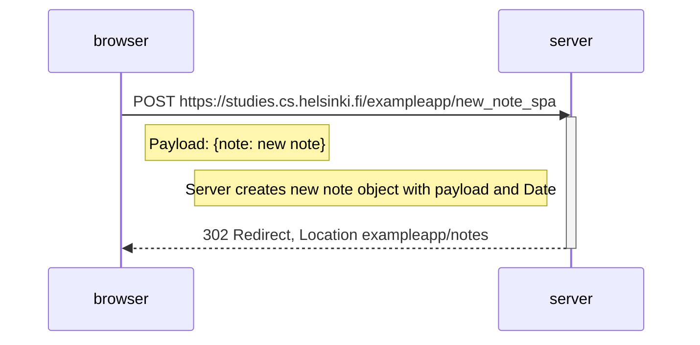

Here is a diagram depicting the network calls when creating a new note in the single page app:

```mermaid
sequenceDiagram
    participant browser
    participant server

    browser->>server: POST https://studies.cs.helsinki.fi/exampleapp/new_note_spa
    activate server
    Note right of browser: Payload: {note: new note}
    Note left of server: Server creates new note object with payload and Date
    server-->>browser: 302 Redirect, Location exampleapp/notes
    deactivate server

    
```